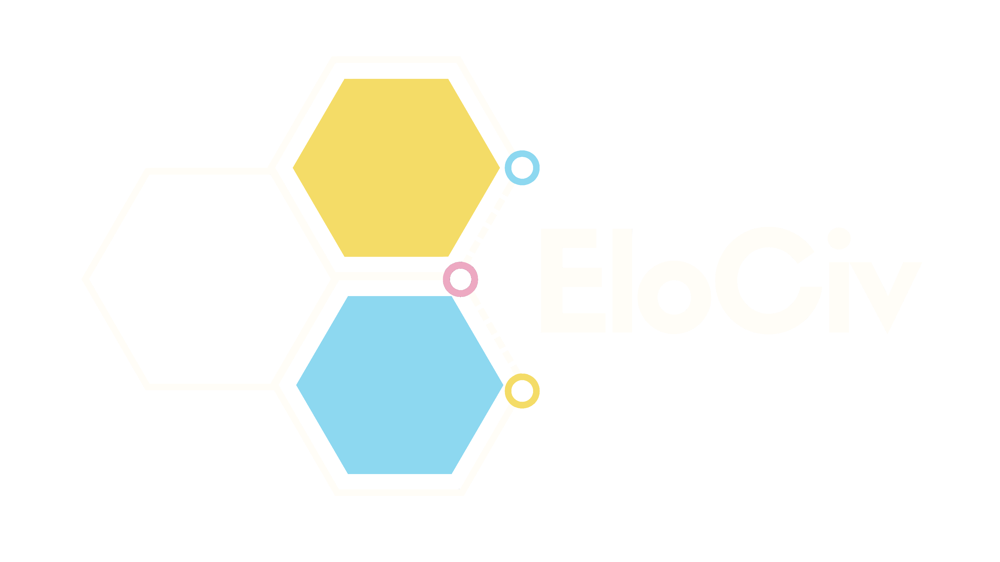

# EloCiv — O Elo da Cidadania Jovem



## Sobre o desafio
Projeto oficial submetido ao desafio **UNICEF Youth Challenge Blockchain 2026**.

## Objetivo
Construir uma solução descentralizada baseada em blockchain capaz de registrar, validar e certificar a participação e a trajetória cívica de jovens em todo o Brasil através de Credenciais Verificáveis W3C e ancoragem de hashes criptográficos em Smart Contracts Soroban na rede Stellar.

---

## O Problema e a Solução

### Problemática
A participação de jovens em projetos sociais, ativismo, oficinas e formações complementares sofre com três grandes gargalos estruturais:

- **Invisibilidade e Fragmentação de Histórico:** As experiências e certificações obtidas pelos jovens ficam dispersas em arquivos locais ou sistemas isolados de ONGs. Quando uma instituição encerra suas atividades ou altera seus sistemas, o histórico do jovem é perdido.
- **Desertos de Oportunidades:** Governos, ONGs e financiadores sociais não possuem mapas geolocalizados de densidade de oportunidades e cobertura de ODS, dificultando a identificação de territórios periféricos negligenciados.
- **Privacidade do Menor (LGPD / ECA):** Armazenar dados pessoais de crianças e adolescentes diretamente em redes públicas de blockchain violaria legislações de proteção a menores.

### Solução
Desenvolvemos uma **plataforma Web3 descentralizada com abordagem *Privacy-by-Design*** que constrói o "currículo cívico" do jovem, estruturada em três pilares:

- **Ancoragem On-Chain em Soroban (Stellar):** O backend gera a credencial no formato padrão W3C Verifiable Credentials, calcula o resumo criptográfico (hash SHA-256) e envia para ancoragem imutável no contrato inteligente `elociv-registry`. Nenhum dado pessoal vai para a blockchain.
- **Carteira Cívica Portátil:** O jovem é o único detentor do seu histórico cívico, podendo escolher quais credenciais tornar públicas ou manter privadas ao apresentar seu currículo para oportunidades futuras.
- **Mapeamento Territorial e Cobertura de ODS:** Visualização geográfica pública da oferta de oportunidades por município e estado, evidenciando lacunas de ODS para direcionamento assertivo de investimentos sociais.

---

## Links e Documentação

- **Documentação Técnica Completa:** [docs/README.md](docs/README.md)
- **Documentação do Smart Contract (Soroban/Rust):** [docs/smart-contract/README.md](docs/smart-contract/README.md)
- **Documentação do Backend (APIs & Schema):** [docs/backend/README.md](docs/backend/README.md)

### Demonstração funcional
O fluxo principal é orquestrado através de 3 módulos:
1. **Oportunidades & Mapa Territorial:** Descoberta de oportunidades presenciais e remotas por município/estado com filtros por ODS, categoria e faixa etária.
2. **Painel da Instituição & Emissão:** Organizações verificadas registram a conclusão da participação juvenil e emitem credenciais verificáveis.
3. **Carteira Cívica & Verificação On-Chain:** Visualização da linha do tempo do jovem e validação em tempo real da prova criptográfica de existência e status no Smart Contract Soroban.

### Smart Contracts Deployados (Stellar Testnet)
- **`elociv-registry` (Soroban / Rust):** [`CAPDGWHKOYYG2VON7NOQHOEQSHNLMJQ2KKDCD6CN7V72323GCUJVMGRH`](https://stellar.expert/explorer/testnet/contract/CAPDGWHKOYYG2VON7NOQHOEQSHNLMJQ2KKDCD6CN7V72323GCUJVMGRH)

---

## Exemplos de aplicação no projeto
- Portabilidade e autonomia da trajetória cívica do jovem.
- Registro imutável e à prova de fraude de cursos, oficinas, voluntariado e ativismo juvenil.
- Mapeamento público de "desertos de oportunidades" e cobertura de ODS para direcionamento de recursos sociais.
- Preservação estrita da privacidade de menores (*Privacy-by-Design* com hashing SHA-256 off-chain).

---

## Tecnologias utilizadas
- **Smart Contracts:** Rust, Soroban SDK (Stellar), Stellar CLI.
- **Rede Blockchain:** Stellar Testnet (Soroban RPC).
- **Backend:** Node.js, Fastify, TypeScript, Prisma ORM, PostgreSQL, `@stellar/stellar-sdk`.
- **Frontend Web:** React 19, TypeScript, Vite, Tailwind CSS v4, Lucide Icons.
- **Containerização:** Docker, Docker Compose.

---

## Estrutura do Repositório
- `/contracts`: Código-fonte dos Smart Contracts em Rust (`elociv-registry`)
- `/backend`: API RESTful Node.js Fastify, schemas Prisma e serviço de integração Stellar
- `/frontend`: Aplicação Web SPA React/Vite com cliente API e adaptadores
- `/docs`: Documentação técnica completa do projeto

---

## Como executar

### Opção 1: Execução Completa via Docker Compose (Recomendado)

```bash
# Na raiz do projeto, suba o PostgreSQL e o Backend:
sudo docker compose up -d

# Acesse a pasta do frontend e inicie a aplicação web:
cd frontend
npm install
npm run dev
```

### Opção 2: Execução Manual em Desenvolvimento

#### 1. Backend e Banco de Dados
```bash
# Na pasta backend:
cd backend

# Instalar dependências
npm install

# Executar migrações do banco e seed inicial (IBGE e ONGs)
npx prisma migrate dev
npm run db:seed

# Iniciar o servidor backend Fastify
npm run dev
```

#### 2. Frontend
```bash
# Em outro terminal, na pasta frontend:
cd frontend

# Instalar dependências
npm install

# Iniciar a aplicação web
npm run dev
```

#### 3. Smart Contract (Compilação e Testes Rust)
```bash
# Na pasta do contrato:
cd contracts/elociv-registry

# Executar a suíte de testes unitários e de simulação
cargo test

# Compilar para WebAssembly (Wasm)
cargo build --target wasm32-unknown-unknown --release
```

---

## Requisitos mínimos do desafio
- **Uso de blockchain:** Sim (Ancoragem de credenciais e verificação em tempo real via Soroban SDK na Stellar Testnet).
- **Registro auditável:** Sim (Hashes SHA-256 e carimbos de tempo imutáveis e verificáveis no ledger Stellar).
- **Smart contract funcional:** Sim (Suíte de 6 testes unitários e de simulação passando cleanly).
- **Histórico verificável:** Sim (Página `/credenciais/:id` com consulta em tempo real ao contrato Soroban).
- **Docker configurado:** Sim (Dockerfile multi-estágio e `docker-compose.yml`).
- **README funcional:** Sim.

---

## Declaração de Uso de Inteligência Artificial (IA)

Em conformidade com as diretrizes do desafio, declaramos que ferramentas de IA generativa foram utilizadas estritamente em papel de apoio ao desenvolvimento do projeto, mantendo a autoria intelectual e supervisão técnica totalmente centralizadas na equipe.

### Ferramentas Utilizadas
- **Modelos:** Google Gemini, OpenAI ChatGPT, Anthropic Claude.

### Escopo de Aplicação
1. **Concepção:** Brainstorm inicial de ideias, validação de regras de negócio e refinamento da proposta de valor do EloCiv.
2. **Qualidade e Segurança do Código:** Auxílio na revisão de código, refatoração de adaptadores de tipo e padronização do contrato inteligente Soroban.
3. **Documentação:** Apoio na estruturação lógica, revisão ortográfica e padronização da documentação técnica e deste arquivo README.
4. **Design e Interface:** Auxílio na construção de componentes acessíveis e responsivos no frontend React.

*> **OBS:** Toda a arquitetura do ecossistema de smart contracts Soroban, integração backend/blockchain e lógica de credenciais verificáveis foi desenvolvida, revisada e é perfeitamente compreendida e explicável pelos integrantes do time.*

---

## Equipe

| Membro | Função / Foco | LinkedIn |
|---|---|---|
| **Stephani Domenighi** | Liderança e Coordenação | [](https://www.linkedin.com/in/stephani-domenighi-565309258) |
| <br/>**[Francisco Josias Batista](https://github.com/josiasdev)** | Desenvolvimento e Arquitetura | [](https://www.linkedin.com/in/josias-batista/) |
| <br/>**[Timóteo Bentes](https://github.com/timoteobentes)** | Desenvolvimento e Interface | [](https://www.linkedin.com/in/timoteo-bentes/) |
| **Michelle Xie** | Marketing e Suporte | [](https://www.linkedin.com/in/michelle-ruixin-xie/) |
| **Ana Azevedo** | Documentação e Conteúdo | [](https://www.linkedin.com/in/anaeduardatsa) |
